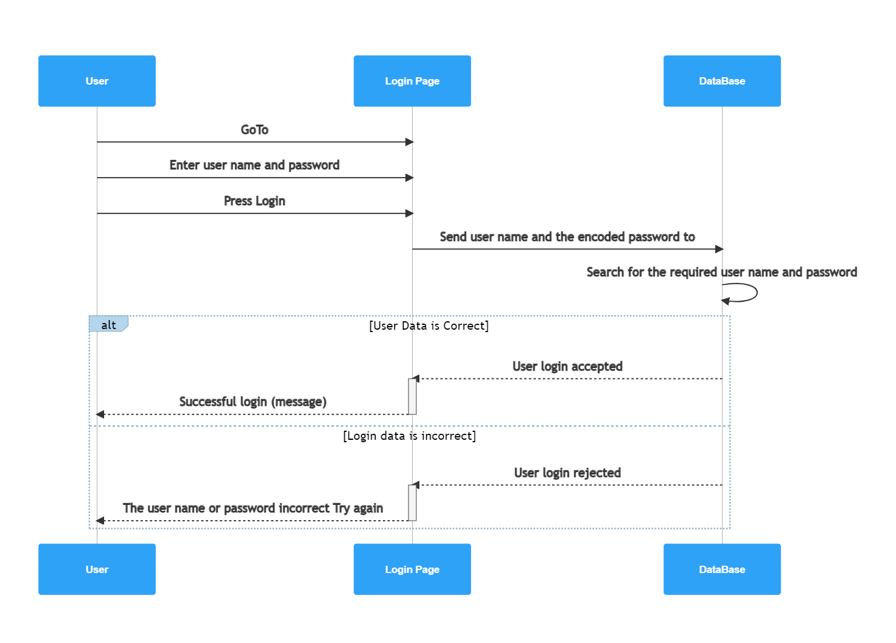

# Basic-auth
### links for my work 
* this is the pull request link [pull request](https://github.com/Muradazzeh/basic-auth/pull/1)
* this is the link for action page from git hub [action page](https://github.com/Muradazzeh/basic-auth/actions)
* this is the link for heroku web site [ herokulink](https://murad-basic-auth.herokuapp.com/)
* this is the link for main repo [ repo link ](https://github.com/Muradazzeh/basic-auth)

## Intrduction 
* First we start with Singleton , what is Singleton : it is a software pattern that restricts the instantiation of a class to one "single" instance.
* what is authentication and authorization :
    *  authentication: is the process of verifying who someone is.
    * authorization : is the process of verifying what specific applications, files, and data a user has access to.

* in our words , we can say that authentication is, who are you , do you have the user name and the password , so you can access to the web site . 
* in other hand the authorization , which page or data the user can access 
* we talk about bcrypt is a password-hashing function, and base-64
* also we want to create two routes one for the sign in and the other one for the sing up.
* we have a rule for the sign in , that we have to send the data in special header called Authorization , it is object [key , value]
it will be in this form **Basic encode(username:password)**
* after we send the special header , the server will read the header then it will decode the password .
* then it will check if there same user name and password in the data base .
* finally if the server found result then it will give the user permision to the web page 

### What I did in the Lap 06 
* First I create new repo called basic - auth and I cloned it locally 
then I started with the basic server installation , for the depandancy, **npm init -y** , **npm dotenv , express , sequelize , pg , SQLlite3, bcrypt, base-64,jest , supertest** 

* also as the last lap , I prepared config.json file for the 3 phases ,development, test,production.
and I set the dotenv variables for the 3 phases  so on each command these variable will do somthing , on npm run start , dev , test 
  * on running dev it will creat dotenv varible it will read the development from json file so it will work on similar fake data base using SQL light 
    * last when we deploy it to heroku the dot env variable will change to production so it will use main database , PostGres
* We have the start up code on one page index.js , so the requirment is to do modulation , to do best practies and  to separate each routes and module as shown below : 
.png) 
* before start coding and prepaing I did UMl digram for the server , And I did sequence digrame for login and sign up as shown below :
.jpg)
* and this is the sign up digram 

*  this digram for logIn 

* then I start moduling , I divided the index.js , and I created the server .js , in the server I handle all the routes , not found error and server error , also I created 2 routes for sign in and sign up and I handled them in the server.js 
* As the last lap I used sequelized in the model to help us in database . 
* the sequlize will do all the work , will connect to the data base and it will create the table depends on the modle that we have .
* I created the user model , it is the schema for data base , .
* I used Post method in the sign up routes to put data into database 
* In the Log In route , we should do a middle ware function to do the logic for checking the user name and password  , and if it found the next() fuction will move to the main function as shown : 
 .jpg)

 * After finishing the validation the next function will move us to the Sign In route . 

 * After every thing is ok I tested the routes using post on body , and special header  as shown below and all shows ok 
 .png)
 .png)
 .png)
 * now I prepared the Jest test for My server , I need to check 404 not found error and 500 server error , also I want to test home route , and I need to prepare tests for sing up route and log in route and middle ware as shown  

 * Then I push the work to the github and I merge it to the main branch so I get this result from gitHub action 
 .png)
* The next step will be deploying in Heroku , the deployed success on heroku web site but we need to test the link using other app , So I used thunder client to check the heroku link as shown below 
.png)
.png)

